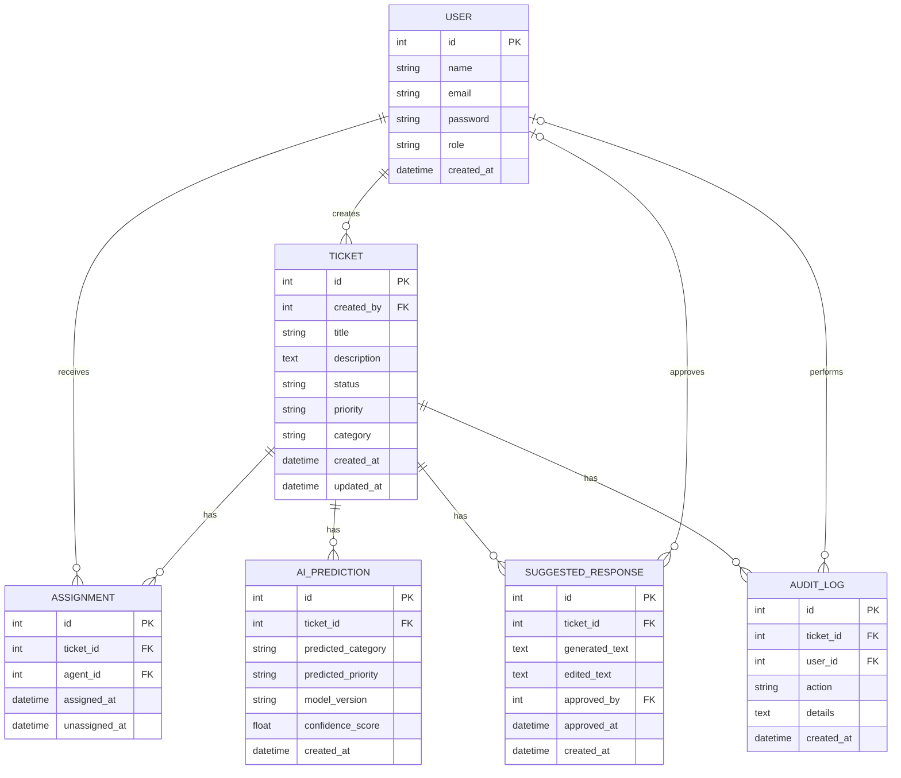

# Entity Relationship Diagram

## 1. Purpose

This document describes the initial database design for the AI-Assisted Support Ops Platform.

The ERD shows:

- what information the system stores
- which entities/tables exist
- the important fields inside each table
- primary keys and foreign keys
- how the tables are related

This is an initial design. It may change later when we implement the database with Django and PostgreSQL.

---

## 2. ERD Basics

### Entity

An entity is a thing that we want to store information about.

Examples:

- User
- Ticket
- Assignment

In the database, these will usually become tables.

### Attribute / Field

A field stores information about an entity.

Example:

```text
USER
- id
- name
- email
```

`name` and `email` are fields of the User entity.

### Primary Key (PK)

A Primary Key uniquely identifies one record.

Example:

```text
USER

id | name
---|------
7  | Alice
8  | Bob
```

`id` is the Primary Key.

Even if two users have the same name, their IDs are different.

### Foreign Key (FK)

A Foreign Key points to a record in another table.

Example:

```text
USER
id = 7
name = Alice

TICKET
id = 101
created_by = 7
```

Here:

```text
Ticket.created_by → User.id
```

So Ticket 101 was created by Alice.

---

## 3. Relationship Notation

The Mermaid ERD uses symbols such as:

```text
|| = exactly one
o{ = zero or many
o| = zero or one
```

Example:

```text
USER ||--o{ TICKET
```

means:

> One User can create zero or many Tickets, while each Ticket has exactly one creator.

Human view:

```text
Alice
├── Ticket 101
├── Ticket 102
└── Ticket 103
```

Alice could also have created zero tickets.

---

## 4. Main Entities

### User

Represents a person using the system.

A User can have one of these roles:

- CUSTOMER
- AGENT
- ADMIN

Examples:

- Customer Alice creates a ticket.
- Support Agent Bob handles a ticket.
- An Admin manages users and system configuration.

### Ticket

Represents a support request submitted by a customer.

Example:

```text
Ticket 101
Title: Payment failed
Status: NEW
Priority: HIGH
Category: BILLING
```

### Assignment

Records which support agent is assigned to a ticket.

We use a separate Assignment entity because a ticket may move between agents over time.

Example:

```text
Ticket 101
→ Alice handled it from 10:00 to 11:30
→ Bob handled it from 11:30 onward
```

Without Assignment history, changing the agent would overwrite the previous agent information.

### AI Prediction

Stores the result of an ML prediction for a ticket.

Example:

```text
Ticket 101

predicted_category = BILLING
predicted_priority = HIGH
confidence_score = 0.91
model_version = v1
```

A ticket may have multiple predictions because:

- the model may run again
- a new model version may be tested
- we may want prediction history for evaluation

### Suggested Response

Stores an AI-generated response draft.

Example:

```text
Generated:
"Your payment issue has been received..."

Agent edits it.

Final:
"We have reviewed your payment issue..."
```

The AI-generated response must not be sent automatically.

A human support agent must review and approve it first.

### Audit Log

Records important actions that happened in the system.

Example:

```text
10:00  TICKET_CREATED
10:01  AI_CLASSIFIED
10:02  AGENT_ASSIGNED
10:10  RESPONSE_GENERATED
10:15  RESPONSE_APPROVED
```

This helps us understand:

- what happened
- when it happened
- who performed the action
- what the AI did
- whether a human changed or approved something

---

## 5. Relationships in Plain English

### User → Ticket

One User can create zero or many Tickets.

Each Ticket has exactly one customer who created it.

```text
User 1 -------- many Ticket
```

Foreign key:

```text
Ticket.created_by → User.id
```

---

### Ticket → Assignment

One Ticket can have zero or many Assignments over time.

Each Assignment belongs to exactly one Ticket.

```text
Ticket 1 -------- many Assignment
```

Foreign key:

```text
Assignment.ticket_id → Ticket.id
```

---

### User / Agent → Assignment

One support agent can receive zero or many Assignments.

Each Assignment belongs to exactly one support agent.

```text
User 1 -------- many Assignment
```

Foreign key:

```text
Assignment.agent_id → User.id
```

Together:

```text
TICKET ----< ASSIGNMENT >---- USER / AGENT
```

This allows us to represent a many-to-many relationship over time:

- one ticket may be handled by several agents
- one agent may handle many tickets

---

### Ticket → AI Prediction

One Ticket can have zero or many AI Predictions.

Each AI Prediction belongs to exactly one Ticket.

```text
Ticket 101
├── Prediction v1
├── Prediction v2
└── Prediction v3
```

Foreign key:

```text
AI_Prediction.ticket_id → Ticket.id
```

---

### Ticket → Suggested Response

One Ticket can have zero or many Suggested Responses.

Each Suggested Response belongs to exactly one Ticket.

Example:

```text
Ticket 101
├── Draft 1
└── Draft 2
```

Foreign key:

```text
Suggested_Response.ticket_id → Ticket.id
```

---

### User → Suggested Response

A User acting as a support agent can approve many Suggested Responses.

A Suggested Response may have no approver yet while it is waiting for approval.

Foreign key:

```text
Suggested_Response.approved_by → User.id
```

`approved_by` is therefore optional until approval happens.

---

### Ticket → Audit Log

One Ticket can have many Audit Log entries.

Each Audit Log entry belongs to one Ticket.

Foreign key:

```text
Audit_Log.ticket_id → Ticket.id
```

---

### User → Audit Log

A User can perform many logged actions.

However, some actions are performed automatically by the system or AI.

Therefore:

```text
Audit_Log.user_id
```

can be optional.

Examples:

```text
RESPONSE_APPROVED
user_id = Bob's ID
```

but:

```text
AI_CLASSIFIED
user_id = null
```

because the system performed the action.

---

## 6. Entity Fields

### User

| Field | Purpose |
|---|---|
| `id` | Unique user identifier |
| `name` | User's name |
| `email` | User's email/login |
| `password` | Password hash managed securely; never plain text |
| `role` | CUSTOMER, AGENT, or ADMIN |
| `created_at` | When the account was created |

---

### Ticket

| Field | Purpose |
|---|---|
| `id` | Unique ticket identifier |
| `created_by` | Customer who created the ticket |
| `title` | Short description of the problem |
| `description` | Full customer request |
| `status` | NEW, CLASSIFIED, ASSIGNED, etc. |
| `priority` | Current accepted priority |
| `category` | Current accepted category |
| `created_at` | When the ticket was created |
| `updated_at` | Last modification time |

`priority` and `category` represent the current values used by the application.

The original ML predictions are stored separately in `AI_PREDICTION`, allowing us to compare AI predictions with final human-approved values later.

---

### Assignment

| Field | Purpose |
|---|---|
| `id` | Unique assignment identifier |
| `ticket_id` | Ticket being assigned |
| `agent_id` | Agent receiving the ticket |
| `assigned_at` | When the assignment started |
| `unassigned_at` | When the assignment ended |

Example:

```text
id | ticket_id | agent_id | assigned_at | unassigned_at
1  | 101       | 7        | 10:00       | 11:30
2  | 101       | 8        | 11:30       | null
```

This means:

```text
Ticket 101
→ Agent 7 handled it first
→ Agent 8 handles it now
```

---

### AI Prediction

| Field | Purpose |
|---|---|
| `id` | Unique prediction identifier |
| `ticket_id` | Ticket that was analyzed |
| `predicted_category` | Predicted category |
| `predicted_priority` | Predicted priority |
| `model_version` | Model that produced the prediction |
| `confidence_score` | Model confidence |
| `created_at` | When prediction occurred |

---

### Suggested Response

| Field | Purpose |
|---|---|
| `id` | Unique response identifier |
| `ticket_id` | Related ticket |
| `generated_text` | Original AI-generated response |
| `edited_text` | Human-edited response, if changed |
| `approved_by` | Agent who approved it; optional until approval |
| `approved_at` | When approval happened |
| `created_at` | When the AI suggestion was created |

Keeping both `generated_text` and `edited_text` allows us to later measure how much humans change AI suggestions.

---

### Audit Log

| Field | Purpose |
|---|---|
| `id` | Unique audit record identifier |
| `ticket_id` | Related ticket |
| `user_id` | Human who performed the action; optional |
| `action` | Type of action |
| `details` | Additional information about what happened |
| `created_at` | When the action happened |

Example actions:

```text
TICKET_CREATED
AI_CLASSIFIED
PRIORITY_PREDICTED
AGENT_ASSIGNED
RESPONSE_GENERATED
RESPONSE_EDITED
RESPONSE_APPROVED
```

---

## 7. Full ERD



---

## 8. ERD Summary

The main structure is:

```text
                         USER
                       /  |  \
                      /   |   \
               creates  assigns  approves/performs
                    /     |          \
                   v      v           v
                TICKET  ASSIGNMENT  Suggested Response / Audit Log
                   |
          +--------+---------+----------------+
          |                  |                |
          v                  v                v
     ASSIGNMENT       AI_PREDICTION    SUGGESTED_RESPONSE
          |
          v
       USER / AGENT

TICKET
   |
   +----< ASSIGNMENT >---- USER / AGENT
   |
   +----< AI_PREDICTION
   |
   +----< SUGGESTED_RESPONSE
   |
   +----< AUDIT_LOG
```

The central entity is `TICKET`.

Most other entities exist to record something that happened to or around a ticket.

---

## 9. Design Decisions to Remember

### Why have a separate Assignment table?

Because we want assignment history.

Instead of:

```text
Ticket.agent_id = Bob
```

which loses information about previous agents, we store:

```text
Assignment 1 → Ticket 101 → Alice
Assignment 2 → Ticket 101 → Bob
```

---

### Why can one Ticket have many AI Predictions?

Because:

- predictions may be rerun
- models may change
- we want evaluation history

This allows comparisons such as:

```text
Model v1 → HIGH
Model v2 → MEDIUM
Human final decision → HIGH
```

---

### Why store generated and edited response text?

Because later we want to evaluate AI usefulness.

Example:

```text
AI generated response
        ↓
Human edited response
        ↓
Final approved response
```

We can measure how often humans accept or modify AI suggestions.

---

### Why have an Audit Log?

Because this system makes AI-assisted decisions.

We want to be able to answer:

```text
What happened?
Who did it?
When?
What did the AI predict?
Did a human override it?
Who approved the final response?
```

This makes the system more auditable.

---

## 10. Important Note

This ERD is the initial Phase 0 design.

It is not expected to be permanently perfect.

When we begin implementing PostgreSQL and Django models, we may discover reasons to change:

- fields
- relationships
- constraints
- indexes
- user/role representation
- audit log structure

Those changes should be made deliberately and documented rather than silently changing the design.


